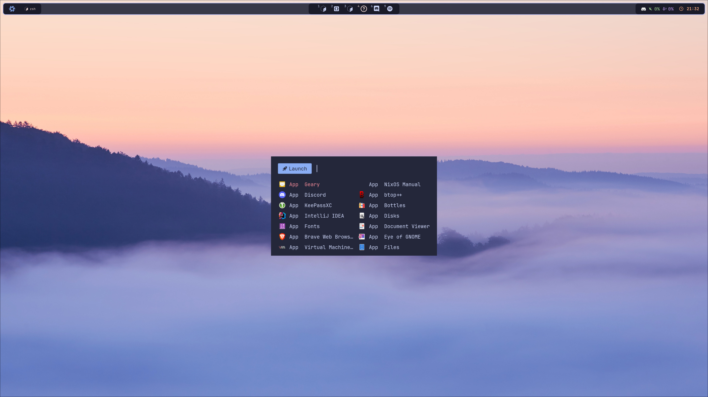
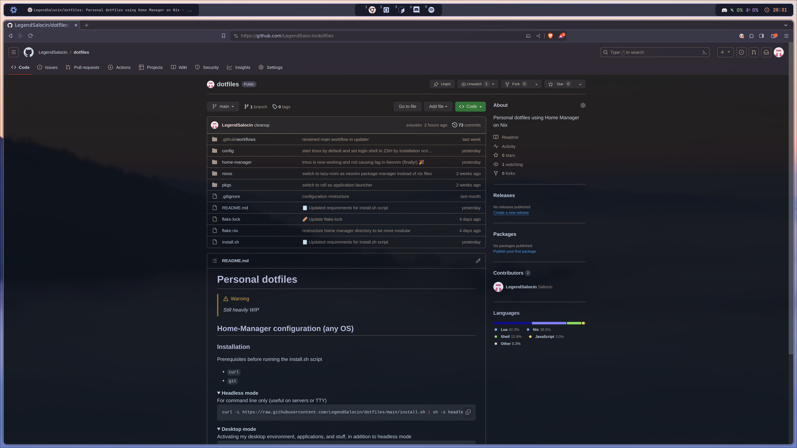
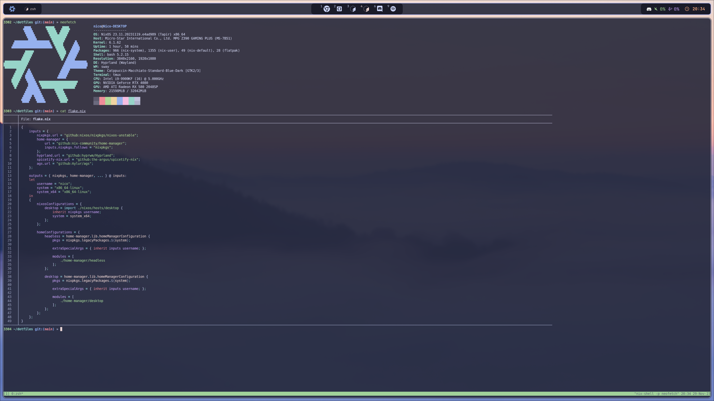
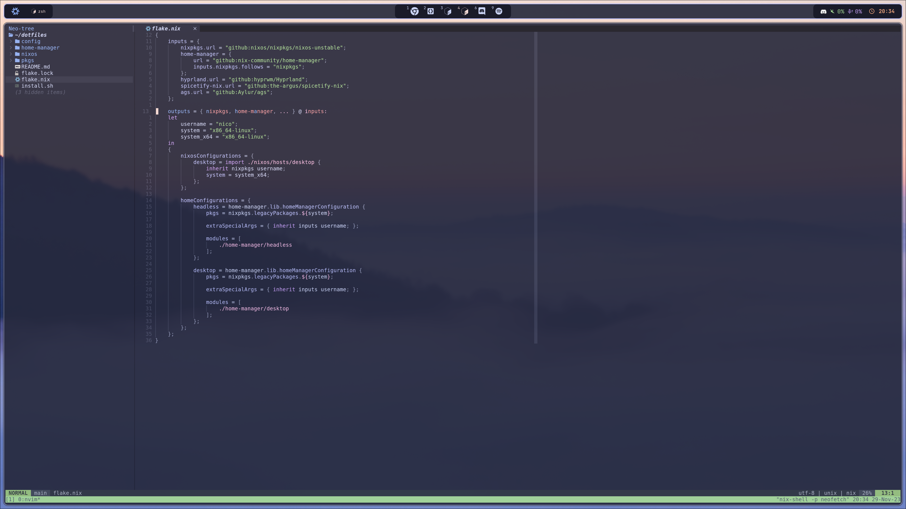

# Personal dotfiles

> [!WARNING]  
> *Still heavily WIP*

<b>Package Manager</b>: Nix

<b>Shell</b>: ZSH

<b>Editor</b>: Neovim

<b>Desktop Environment</b>: Hyprland

<b>Status Bar</b>: EWW (configuration very experimental and not uploaded yet)

<b>Notification Daemon</b>: dunst

<b>Application Launcher</b>: rofi

<b>Browser</b>: Brave


|  |  |
|:---:|:---:|
|  |  |

## Installation

### Home-Manager configuration (any OS)
Prerequisites before running the install.sh script
* `curl`
* `git`

<details open>
  <summary><b>Headless mode</b></summary>
  For command line only (useful on servers or TTY)
  
  ```sh 
  curl -L https://raw.githubusercontent.com/LegendSalocin/dotfiles/main/install.sh | sh -s headless
  ```
</details>

<details open>
  <summary><b>Desktop mode</b></summary>
  Activating my desktop environment, applications, and stuff, in addition to headless mode
  
  ```sh
  curl -L https://raw.githubusercontent.com/LegendSalocin/dotfiles/main/install.sh | sh -s desktop
  ```
</details>

<br/>

### NixOS configuration (NixOS required)

> [!NOTE]  
> This configuration is specific for my system. It is not recommended to run the following on any other system as this might require additional tinkering to work. Please use the Home-Manager configuration instead (either headless or desktop mode), as it will already give you what you want seen in the screenshots above.

To (re-)build entire NixOS system:
```sh
sudo nixos-rebuild switch --flake .#desktop
```
